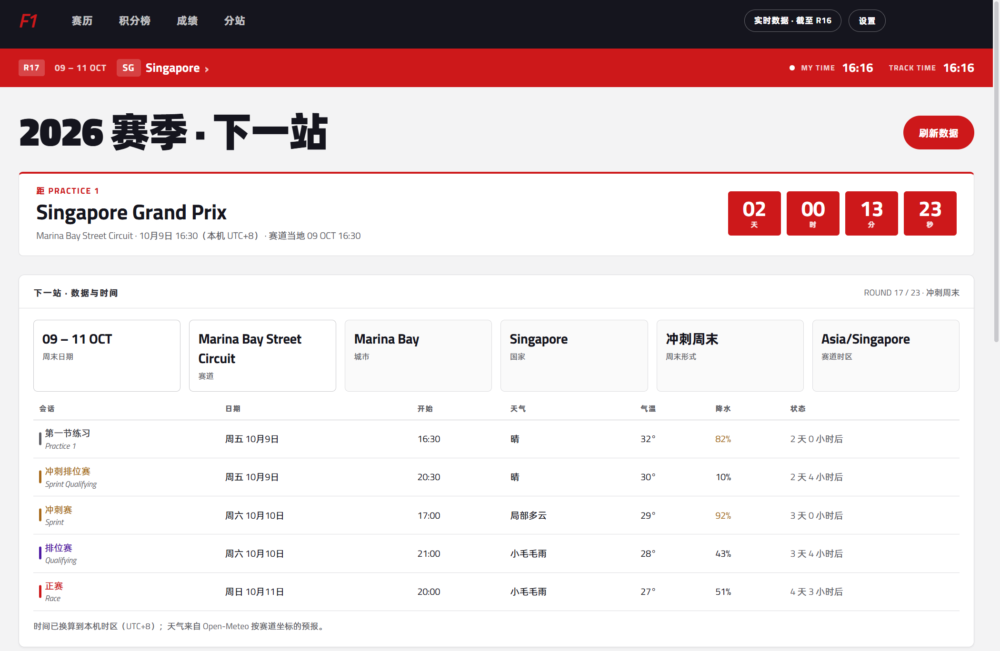
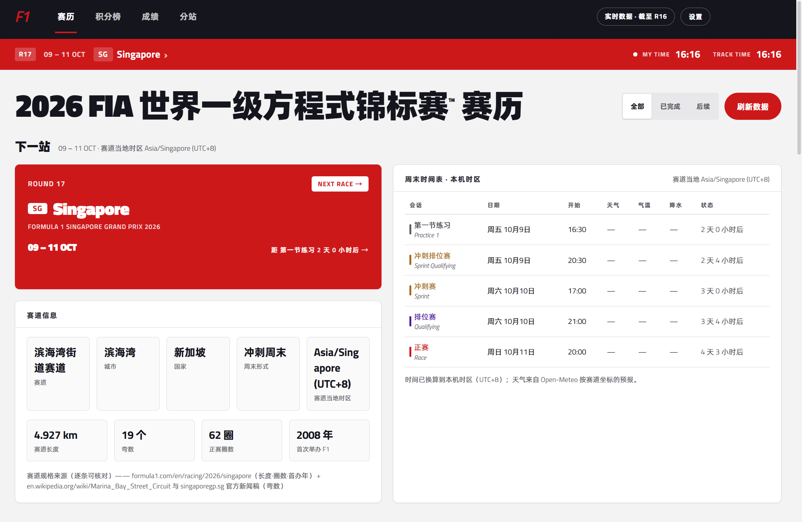
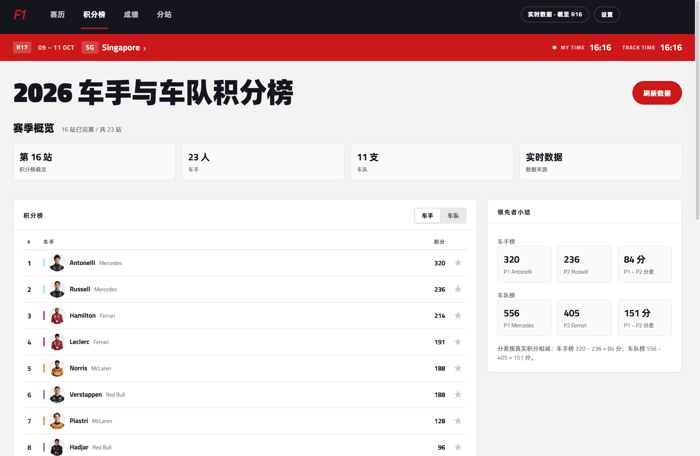
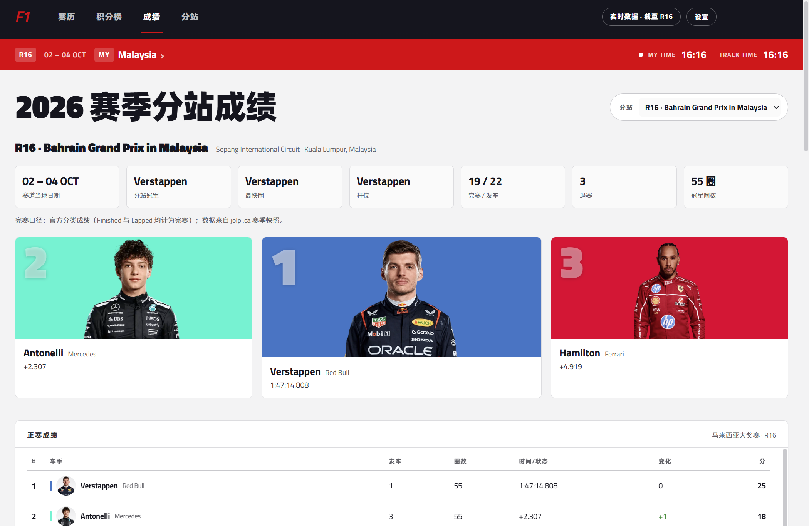
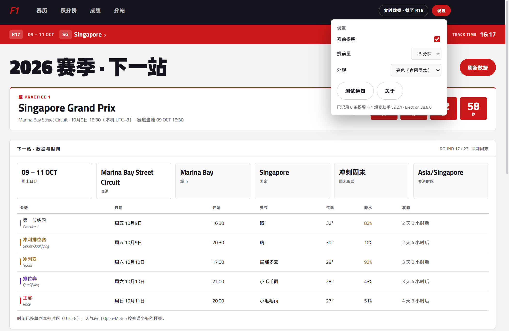

# F1 观赛助手

一个 Windows 桌面应用，用来查看 2026 赛季 F1 的赛程、成绩和积分榜。

数据来自公开接口，同时内置一份赛季快照，断网时也能打开。



## 功能

- **倒计时** —— 首页显示下一节会话（练习赛 / 冲刺排位赛 / 冲刺赛 / 排位赛 / 正赛）的倒计时，同时给出本机时间和赛道当地时间。
- **周末时间表** —— 当前分站每一节会话的日期、开始时间、天气预报和剩余时间。
- **赛前提醒** —— 到点前弹 Windows 通知，提前量可选。提醒在外壳里运行，停在哪一页都会触发。
- **关注置顶** —— 在积分榜点星标关注车队或车手，关注项会在榜单里高亮并排到最前。
- **五个页面** —— 首页、赛历、积分榜、成绩、分站详情，各自独立。
- **离线可用** —— 启动先读本地快照，联网后在后台刷新，成功才重绘。

## 界面

| 赛历 | 积分榜 |
|---|---|
|  |  |

| 成绩 | 设置 |
|---|---|
|  |  |

## 目录

```
index.html                  首页
pages/                      赛历 / 积分榜 / 成绩 / 分站
electron/                   主进程与 preload
assets/
  css/  js/                 样式与脚本（config / store / net / data / domain / ui / pages）
  data/season.json          赛季快照
  fonts/  img/              字体、车手照片、车队徽标
tools/                      抓数、抓图、断言、打包辅助
docs/                       页面规格与开发记录
```

## 许可

代码以 [MIT](LICENSE) 发布。
